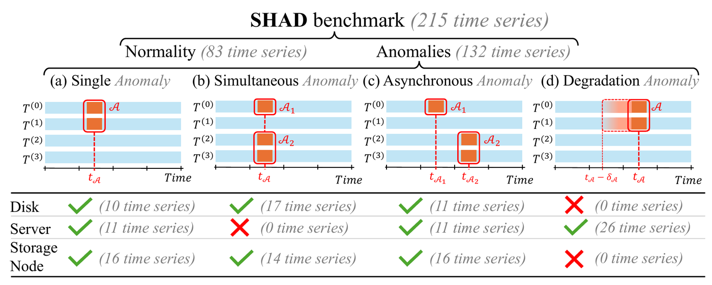
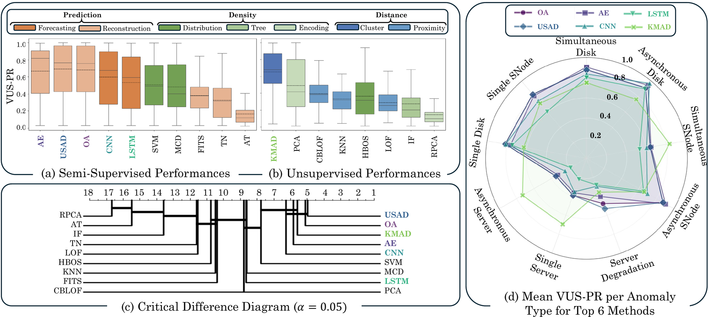

<h1 align="center">SHAD</h1>
<h3 align="center">Detect, Explain, Interpret: an end-to-end benchmark for time series<br>anomaly detection, explainability and interpretability</h3>

<p align="center">
  <a href="https://scality.github.io/shad/"></a>
  <a href="https://scality.github.io/shad/explorer.html"></a>
  
  <a href="LICENSE"></a>
  
</p>

<p align="center">
  <a href="https://scality.github.io/shad/"><b>Website</b></a> ·
  <a href="https://scality.github.io/shad/explorer.html"><b>Dataset explorer</b></a> ·
  <a href="https://scality.github.io/shad/docs.html"><b>Documentation</b></a> ·
  <a href="notebooks/getting_started.ipynb"><b>Getting-started notebook</b></a> ·
  <a href="#citation"><b>Citation</b></a>
</p>

**SHAD** (**S**cality **H**igh-dimensional **A**nomaly **D**etection benchmark) is a fully annotated benchmark of
**215 real-world, 171-dimensional time series** collected on [Scality RING](https://www.scality.com/ring/), a distributed
object storage system, while disk, server and storage-node failures were injected under a realistic S3 workload.

Unlike existing anomaly detection benchmarks, which only say *when* something went wrong, SHAD also says **where**
(per-dimension labels of the root-cause sensors) and **what** (type, target component, severity and a textual
explanation in a structured XML annotation). It is the first benchmark that evaluates a complete pipeline:
**detection → explanation → interpretation**.

<p align="center"></p>

## Highlights

- 🗄️ **Real system, real failures** - 3-server Scality RING clusters, ~18 h of telemetry per experiment at 1-minute resolution, failures injected at the OS / network / process level and supervised by Scality engineers.
- 📈 **High-dimensional** - 171 metrics on four levels: platform (17), S3 connector (13), storage server (3 × 19) and device (3 × 7 × 4).
- 🏷️ **Two label layers** - a top-level label (TSB-AD compatible) **and** a per-dimension label for each of the 171 metrics.
- 📝 **Semantic annotations** - one XML file per series with anomaly type, category, criticality, textual explanation, a description of every metric, and for every event its onset, duration, target store / disk, degradation level and related dimensions.
- 🧪 **Baselines for the three tasks** - 18 detectors (VUS-PR), dimension attribution (NDCG) and 5 frozen LLMs on an interpretation questionnaire. None of them solves SHAD.

## The dataset at a glance

| Scenario (`Dataset/` folder) | Type | Category | Criticality | Series |
|---|---|---|---|---:|
| Nominal | – | – | – | **83** |
| Single Disk | Disk | Single | Low | 10 |
| Simultaneous Disk | Disk | Simultaneous | Medium | 17 |
| Asynchronous Disk | Disk | Asynchronous | High | 11 |
| Single Server | Server | Single | Low | 11 |
| Asynchronous Server | Server | Asynchronous | Medium | 11 |
| Server Degradation | Server | Degradation | High | 26 |
| Single SNode | Storage node | Single | Low | 16 |
| Simultaneous SNode | Storage node | Simultaneous | Medium | 14 |
| Asynchronous SNode | Storage node | Asynchronous | High | 16 |
| **Total** | | | | **215** |

Every series is browsable in the **[interactive explorer](https://scality.github.io/shad/explorer.html)** (all 171 dimensions,
labels and annotations), and the full registry is in [`docs/EXPERIMENTS.md`](docs/EXPERIMENTS.md).

## Getting started

### Install

```bash
git clone https://github.com/scality/shad.git
cd shad
pip install -e .            # the `shad` loader (numpy + pandas); use ".[plot]" to add matplotlib
python -m shad              # prints a summary of the dataset
```

### Load a series, its labels and its annotation

```python
from shad import SHAD

ds = SHAD()                         # finds the data when run inside the repository (or SHAD(root=...))
ds.summary()                        # series per scenario
ds.catalog                          # one row per series: id, group, type, category, criticality, explanation, ...

s = ds.load("1773343796")           # a single disk failure
s.data          # (1039, 171) pandas DataFrame, UTC DatetimeIndex, 1-minute sampling
s.labels        # (1039, 171) per-dimension labels
s.label         # (1039,)     top-level label  (== logical OR of the per-dimension labels)
s.X, s.Y, s.y   # the same as numpy arrays
s.segments()                        # [(201, 291)]  anomalous rows (end exclusive)
s.anomalous_dimensions              # ['store1-g2disk01-disk_io_time_seconds', ... 4 dimensions]
s.explanation                       # 'ran on quarry4 ... with a failure on store 1 g2disk01 at time 3h30m for 1h30m'
s.events                            # [AnomalyEvent(offset_minutes=210, duration_minutes=90, store='1', disk='g2disk01', ...)]
s.plot()                            # matplotlib figure of the labelled dimensions

train_ids, test_ids = ds.split()    # paper protocol: 83 nominal series for training, 132 anomalous for testing
ds.filter(type="Server", criticality="High")   # select series by metadata
ds.load("1774026259", fill="ffill")            # impute missing values
```

More in the **[getting-started notebook](notebooks/getting_started.ipynb)**, the
**[documentation](https://scality.github.io/shad/docs.html)**, and a 60-line semi-supervised baseline in
[`examples/baseline_detector.py`](examples/baseline_detector.py).

### Or with plain pandas

```python
import pandas as pd
import xml.etree.ElementTree as ET

df = pd.read_csv("Dataset/Single Disk/1773343796.csv", parse_dates=["metric_timestamp"])
metrics = [c for c in df.columns if c != "metric_timestamp" and not c.startswith("label")]
X = df[metrics].to_numpy()                          # (n, 171) telemetry
Y = df[["label_" + m for m in metrics]].to_numpy()  # (n, 171) per-dimension labels
y = df["label"].to_numpy()                          # (n,)     top-level label

ann = ET.parse("Annotations/1773343796.xml").getroot()
print(ann.findtext("type"), ann.findtext("criticality"), ann.findtext("textual_explanation"))
```

## Data format

**CSV** (`Dataset/<scenario>/<id>.csv`, 344 columns, ~1,000-1,070 rows):

| Column(s) | # | Content |
|---|---:|---|
| `metric_timestamp` | 1 | UTC timestamp, 1-minute sampling |
| `<metric>` | 171 | telemetry, see the [metric dictionary](docs/METRICS.md) |
| `label_<metric>` | 171 | 1 when the dimension belongs to the root-cause component of an ongoing anomaly |
| `label` | 1 | 1 when any anomaly is ongoing |

Metric names are `<metric>` (platform / S3), `<store>-<metric>` (server) or `<store>-<device>-<metric>` (device), with
stores `store1`-`store3` and devices `g1disk01`, `g1disk02`, `g2disk01`, `g2disk02` (NVMe data disks), `ssd01`, `ssd02` (metadata SSDs) and `root`.

**XML** (`Annotations/<id>.xml`): `anomaly_presence`, `category`, `type`, `criticality`, `textual_explanation`, and for each
dimension its `description` and, if it is a root-cause target, its `anomalies` (`offset_minutes`, `duration_minutes`, `store`,
`disk`, `degradation`, `related_dimensions`). See the [format documentation](https://scality.github.io/shad/docs.html#format).

> **Good to know.** `offset_minutes` counts from the first CSV timestamp (the "starting at" time in the explanation is the launch,
> ~11 min earlier). Less than 1% of values are missing, rows are occasionally more than one minute apart, 16 storage-node runs have
> broken telemetry (flagged), and 47 nominal files use `s0-`/`s1-`/`s2-` instead of `store1-`/`store2-`/`store3-` (the loader
> harmonises them). Details in [Known caveats](https://scality.github.io/shad/docs.html#caveats).

## Repository structure

```
Dataset/            215 CSV files, one folder per scenario
Annotations/        215 XML annotations (<id>.xml)
Representations/    Catch22 features and multi-panel images used in the LLM experiment
Scripts/            representation, LLM-interpretability, consistency-check and website scripts
shad/               Python loader package
notebooks/          getting_started.ipynb
examples/           quickstart.py, baseline_detector.py
tests/              pytest checks of the files and the loader
docs/               project website (GitHub Pages), METRICS.md, EXPERIMENTS.md
```

## Benchmark results

| Task | Setting | Main finding |
|---|---|---|
| **Detection** | 18 detectors from [TSB-AD](https://github.com/TheDatumOrg/TSB-AD) (10 semi-supervised trained on the nominal series, 8 unsupervised), VUS-PR | OmniAnomaly, USAD, AE, CNN and the unsupervised KMeansAD are statistically tied at the top, but no method is accurate on every anomaly type. |
| **Explanation** | per-dimension anomaly scores of OA, CNN and KMAD vs. per-dimension labels, NDCG | Native attributions are indistinguishable from a random ranking. |
| **Interpretation** | 5 frozen LLMs, 3 representations (Catch22, images, descriptions), questionnaire on presence / type / criticality / dimension / time, with 0-2 supervision levels | Very low scores (≤ 4% dimension accuracy); adding detection and explanation outputs helps only marginally. |

<p align="center"></p>

### Reproducing the experiments

- **Detection**: detector implementations and hyper-parameters come from [TSB-AD](https://github.com/TheDatumOrg/TSB-AD); train semi-supervised methods on `ds.split()[0]` and evaluate VUS-PR on the anomalous series.
- **Representations**: `python Scripts/generate_images.py` (multi-panel images) and `python Scripts/compute_features.py` (Catch22, needs `pycatch22`) write to `Representations/`.
- **Interpretability**: `pip install -e ".[interpretability]"`, put `MISTRAL_API_KEY=...` in a `.env` file, then `python Scripts/interpretabiliy_main.py` from the repository root.
- **XML queries**: `Scripts/query_XML.py` shows how to query the annotations without the loader.

## Platform context

Each cluster has one supervisor and three storage servers. Each storage server runs an S3 connector and six software storage
nodes that share a Chord distributed hash table, and holds four NVMe data disks, two metadata SSDs and an OS disk. A GET-heavy
S3 workload (~95% GET, [warp](https://github.com/minio/warp), 16 workers, objects up to 100 KiB) runs for 18 hours in every experiment.
When a disk or storage node disappears, the RING rebuilds missing replicas in the background; repair and rebalance tasks follow,
which is why rebuild / repair / balance task rates are part of the telemetry. The full description of the 171 metrics is in
[`docs/METRICS.md`](docs/METRICS.md).

## Citation

If you use SHAD, please cite:

```bibtex
@inproceedings{stanzione2026shad,
  title     = {Detect, Explain, Interpret: An End-to-End Benchmark for Time Series
               Anomaly Detection, Explainability and Interpretability},
  author    = {Stanzione, Roberto and Barbe, Jules and Parrino, Magali and
               Fourmann, J{\'e}r{\'e}mie and Boniol, Paul},
  booktitle = {Advances in Neural Information Processing Systems (NeurIPS),
               Evaluations and Datasets Track},
  year      = {2026}
}
```

## License

The source code and datasets are released under the **AGPL-3.0-only** license. By using, modifying or redistributing this
material you agree to the terms of the license, available in [LICENSE](LICENSE).

SHAD is a collaboration between [Inria](https://www.inria.fr/) (ENS, CNRS, PSL University), [Scality](https://www.scality.com/) and EDF.
